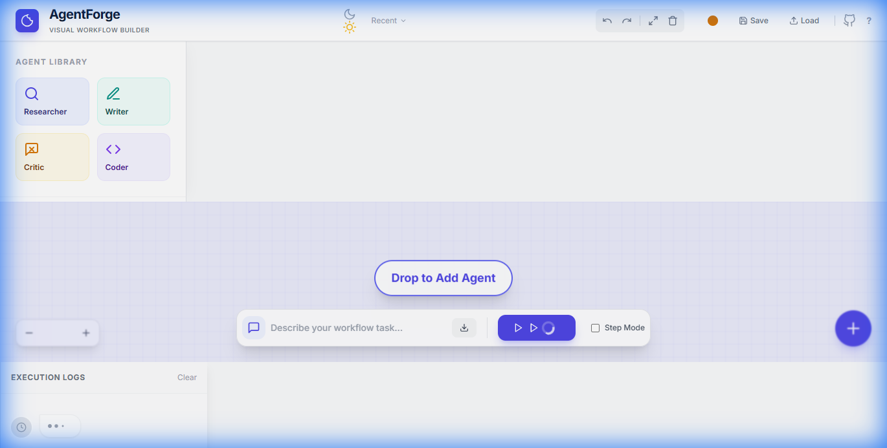

# AgentForge ⚡


**AgentForge** is an enterprise-grade visual IDE for orchestrating autonomous AI agent workflows. Design, connect, and deploy multi-agent systems via a professional drag-and-drop interface, powered by Groq's high-speed inference.



## 🚀 Features

- **Visual Workbench**: Infinite canvas with professional node-based architecture.
- **Specialized Agents**: 
  - 🔍 **Researcher**: Autonomous web scraping and data gathering.
  - ✍️ **Writer**: Professional content synthesis and report generation.
  - 🧐 **Critic**: Quality assurance and fact-checking.
  - 💻 **Coder**: Production-ready code generation.
- **Robust Execution**: Real-time SSE streaming, pause/resume capabilities, and network error handling.
- **Persistence**: Auto-saves your work to local storage; never lose a workflow again.
- **Enterprise Polish**: Glassmorphism UI, WCAG 2.1 AA accessibility, and responsive design.

## 📦 Quick Start

### 1. Clone & Setup
```bash
git clone https://github.com/DynamicKarabo/agent-forge.git
cd agentforge
```

### 2. Configure API
Create a `.env` file in the root:
```env
GROQ_API_KEY=gsk_your_key_here
```

### 3. Run with Docker
```bash
docker-compose up --build
```
Access the app at **http://localhost:8000/frontend/index.html**

## 🧪 Testing & Quality

AgentForge v1.0 meets strict quality standards:
- **Test Coverage**: Comprehensive Playwright suite covering all core flows.
- **Performance**: Optimized for 30+ concurrent nodes at 60fps.
- **Accessibility**: Full ARIA support and high-contrast controls.

See [RELEASE_CHECKLIST.md](RELEASE_CHECKLIST.md) for the full QA sign-off.

## ⚠️ Known Issues
- **Node Overlap**: Auto-layout for complex graphs is currently manual.
- **Mobile**: Best experienced on Desktop/Tablet screens.

## 🤝 Contributing
Stars and forks are welcome! Please open an issue for any bugs found.

---
**Built with ❤️ by Karabo**
